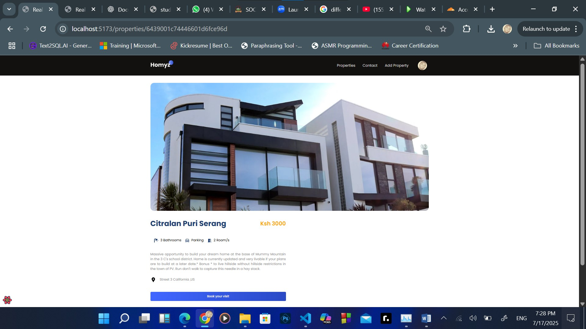

# 🏡 Community-Driven Real Estate Marketplace  

A **full-stack real estate web application** built using the **MERN stack**, designed to empower communities by providing a transparent, secure, and user-friendly property marketplace.  


## 🚀 Features  
- 🔑 **Authentication & Authorization** – Secure user login/signup with Auth0.  
- 🏘 **Property Listings** – Browse, search, and filter community-driven property listings.  
- 📑 **Property Management** – Add, edit, and manage properties with ease.  
- 📊 **User Dashboard** – Personalized dashboards for buyers, sellers, and agents.  
- 🔒 **Secure Transactions** – Emphasis on privacy and security for user data and activities.  

## 🛠 Tech Stack  
- **Frontend**: React, Mantine UI, React Query, React Router  
- **Backend**: Node.js, Express.js  
- **Database**: MongoDB  
- **Authentication**: Auth0  
- **Other Tools**: React Toastify, Axios  

## 📂 Project Structure  
/client → React frontend
/server → Express backend
/database → MongoDB schema & config


## 📌 Getting Started  
1. Clone the repo:  
   ```bash
   git clone https://github.com/yourusername/community-real-estate.git

2. Navigate to project folders and install dependencies:
   cd client && npm install  
   cd ../server && npm install  
3. Run the app:
   npm run dev
